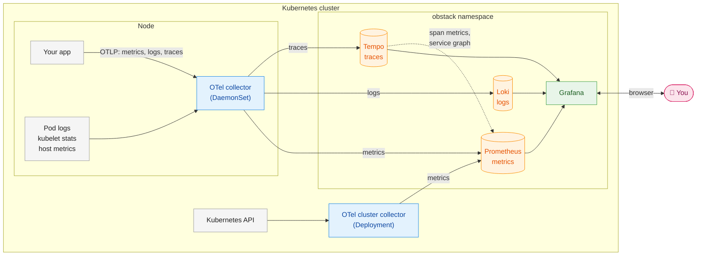

# helm k8s obstack

An opinionated Helm chart that sets up a self-contained observability stack (obstack) for a Kubernetes cluster.
It's built on OpenTelemetry (OTel), **Prometheus**, **Loki**, **Tempo** and **Grafana**.

The chart is published to the public GitHub Container Registry (GHCR) as an OCI Helm chart:
`oci://ghcr.io/danangan/charts/obstack` ([package page](https://github.com/danangan/k8s-obstack/pkgs/container/charts%2Fobstack)).

Features:

- A standardised entry point for metrics, logs and traces using the OTel collector
- Metrics, logs and traces collection for your apps running in Kubernetes
- Kubernetes cluster metrics
- Host (node) metrics
- A Grafana UI to query and explore metrics, logs and traces
- Persistent volume for the backends
- Ingress setup to expose Grafana UI

## Architecture

Components:
- OTel Collectors
  - Run as a k8s DaemonSet, on every k8s node
  - Provide an endpoint where apps submit custom metrics and traces
  - Scrape kubelet metrics
  - Gather host metrics
  - Scrape logs
  - Forward logs, metrics, and traces to their respective backends
- OTel Collector k8s API scraper
  - Scrapes k8s cluster metrics from the cluster API
- Loki
  - Log storage
- Prometheus
  - Metrics storage
- Tempo
  - Trace storage
- Grafana
  - Provides a UI for all telemetry data


Data flow:

OTel collectors gather metrics from your apps, the nodes and the cluster, plus every pod's logs and
your apps' traces. They enrich everything with Kubernetes metadata (namespace, pod, node, deployment)
and push it over OTLP: metrics to Prometheus, logs to Loki and traces to Tempo. You explore all three
in Grafana.


## Usage

### Prerequisites

To start with, you need the following:
- Helm
- kubectl

This chart is opinionated towards AWS EKS as its target, which requires:
- The AWS Load Balancer Controller, which provides the `alb` IngressClass. Grafana is exposed through an internal Application Load Balancer by default.
- The AWS EBS CSI driver (EKS add-on `aws-ebs-csi-driver`)
- A dedicated node group in a single availability zone, labeled `workload=obstack` and tainted
  `dedicated=obstack:NoSchedule`. This ensures that the obstack pods are deployed to a dedicated node group, mainly for storage management and isolation.

### 1. Install the chart

```sh
helm install obstack oci://ghcr.io/danangan/charts/obstack --version <version>
```

The chart is pulled straight from GHCR; there's no `helm repo add` step and no login needed. Available
versions are listed on the [package page](https://github.com/danangan/k8s-obstack/pkgs/container/charts%2Fobstack),
and `helm show chart oci://ghcr.io/danangan/charts/obstack` shows the latest one.

The chart creates the `obstack` namespace and puts everything in it. 

The chart also creates a random Grafana admin password. It's reused on upgrades and kept on uninstall:

```sh
kubectl -n obstack get secret grafana-admin -o jsonpath='{.data.admin-password}' | base64 -d
```

All of these defaults can be changed through values. This is the full reference of available values:

| Value | Default | Description |
| --- | --- | --- |
| `namespace.name` | `obstack` | Namespace for all resources (empty = the release namespace) |
| `placement.nodeSelector` / `.tolerations` / `.affinity` | `workload: obstack` / `dedicated=obstack:NoSchedule` | Where the central components run |
| `storage.className` | `obstack-gp3` | StorageClass for all volumes (empty = cluster default) |
| `storage.storageClass.create` | `true` | Create the EBS gp3 StorageClass (expandable, `Retain`) |
| `<component>.persistence.size` | 50Gi (Grafana 5Gi) | Volume per component: `prometheus`, `loki`, `tempo`, `grafana` |
| `prometheus.retention.time` / `.size` | `15d` / `45GB` | Metrics retention; keep `size` below the volume size |
| `loki.retention` | `336h` | Log retention |
| `tempo.retention` | `168h` | Trace retention |
| `grafana.anonymousAdmin` | `false` | `true` = no login, anonymous admins (local use only) |
| `grafana.adminPasswordSecret.create` | `true` | Create the Secret with a random password (`false` = bring your own) |
| `grafana.adminPasswordSecret.name` / `.key` | `grafana-admin` / `admin-password` | Secret with the admin password |
| `grafana.plugins` | Logs and Traces Drilldown | Plugins installed at startup |
| `ingress.enabled` / `.ingressClassName` | `true` / `alb` | Ingress for Grafana (AWS Load Balancer Controller) |
| `ingress.grafanaHost` | `""` | Hostname for Grafana (empty = any, e.g. the ALB's DNS name) |
| `ingress.annotations` | internal ALB, IP targets | ALB settings: scheme, HTTPS certificate, and so on |
| `otelCollector.debug` | `false` | Also print all telemetry to the collector logs |

See [values.yaml](values.yaml) for everything, including images and resources.

**Growing a volume:** raise `<component>.persistence.size` and run `helm upgrade`. The EBS CSI driver
expands the volume online. Volumes can grow but not shrink. Volume claims are kept on `helm uninstall`.

### 2. Send telemetry from your app

Instrument your app with an OpenTelemetry SDK, and point it at the collector on its own node:

Pod YAML example:
```yaml
env:
  - name: NODE_IP
    valueFrom: {fieldRef: {fieldPath: status.hostIP}}
  - name: OTEL_EXPORTER_OTLP_ENDPOINT
    value: http://$(NODE_IP):4318
  - name: OTEL_SERVICE_NAME
    value: my-app
  # Lets the collector reliably attach this pod's Kubernetes metadata.
  - name: K8S_POD_UID
    valueFrom: {fieldRef: {fieldPath: metadata.uid}}
  - name: OTEL_RESOURCE_ATTRIBUTES
    value: k8s.pod.uid=$(K8S_POD_UID)
```

Logs require no setup: all logs are automatically collected by the OTel collectors.

### 3. Explore in Grafana

Grafana is served by an internal Application Load Balancer, reachable from inside the VPC. Get its
address with:

```sh
kubectl -n obstack get ingress grafana -o jsonpath='{.status.loadBalancer.ingress[0].hostname}'
```

Open it in a browser and log in as `admin`, with the password from the `grafana-admin` Secret. 

Alternatively, if you decide not to use the Ingress, you can access the Grafana UI by port-forwarding with kubectl:

```sh
kubectl -n obstack port-forward svc/grafana 3000
```

## Examples

- [Deployment to AWS EKS](examples/aws-eks/README.md): deploy the stack and the sample app to an
  existing EKS cluster.

## Local development

See the [local development guideline](local-dev/README.md) to run the stack and the sample app on
minikube.

## What gets collected

Every metric, log line and span carries the same Kubernetes metadata: `k8s.namespace.name`,
`k8s.pod.name`, `k8s.pod.uid`, `k8s.node.name` and `k8s.deployment.name`, among others. In Prometheus
and Loki, the dots become underscores (`k8s_pod_name`).

### Metrics

Metrics come from five sources, all pushed to Prometheus over OTLP rather than scraped:

| Source | Collected by | Examples |
| --- | --- | --- |
| **Your apps** | Node collector (`otlp` receiver) | Anything your app records, plus HTTP metrics from auto-instrumentation such as `http_server_duration_milliseconds` |
| **Kubelet**: resource usage of each node, pod and container | Node collector (`kubelet_stats`) | `k8s_node_cpu_usage`, `k8s_pod_memory_working_set_bytes`, `container_cpu_time_seconds_total`, `k8s_pod_network_io_bytes_total` |
| **Host**: the node's operating system, read from `/proc` and its filesystems | Node collector (`host_metrics`) | `system_cpu_load_average_1m`, `system_memory_usage_bytes`, `system_disk_io_bytes_total`, `system_filesystem_usage_bytes` |
| **Kubernetes API**: declared state of cluster objects | Cluster collector (`k8s_cluster`) | `k8s_deployment_available`, `k8s_pod_phase`, `k8s_container_restarts`, `k8s_container_memory_limit_bytes`, `k8s_node_condition_ready` |
| **Traces**: derived by Tempo | Tempo's metrics generator | `traces_spanmetrics_calls_total`, `traces_spanmetrics_latency_bucket`, `traces_service_graph_request_total` |

### Logs

The node collector tails every container's stdout and stderr from the node's `/var/log/pods`, so logs require no further setup on the application side. The OTel collector handles the k8s metadata enrichment for discoverability. Log lines are stored as-is: Loki detects their level from a `level` key in JSON or logfmt lines, and JSON fields are parsed at query time, for example `{service_name="my-app"} | json | status_code="500"`.

### Traces

Apps send spans over OTLP to the node collector, which adds the Kubernetes metadata and forwards them
to Tempo.